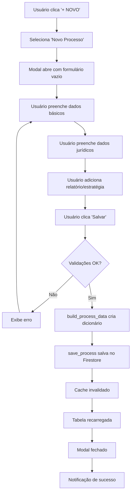
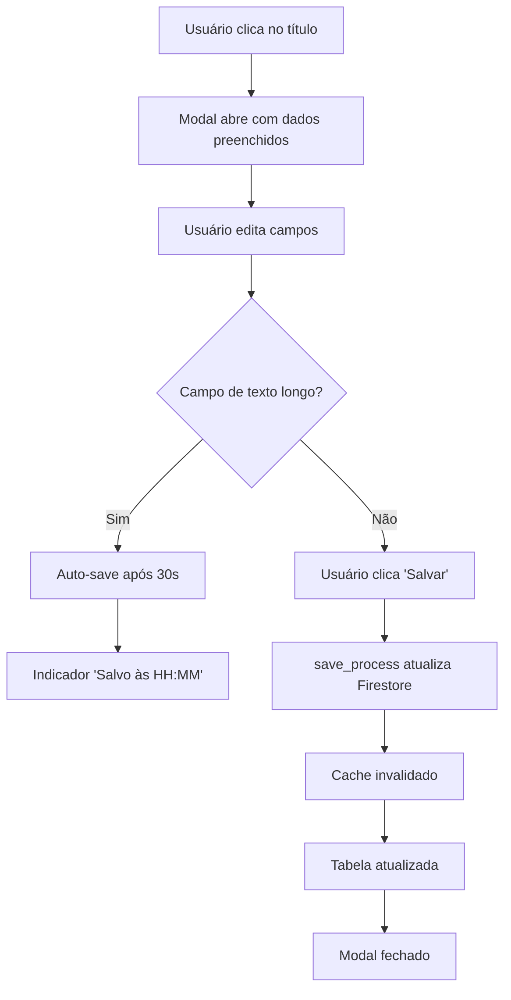
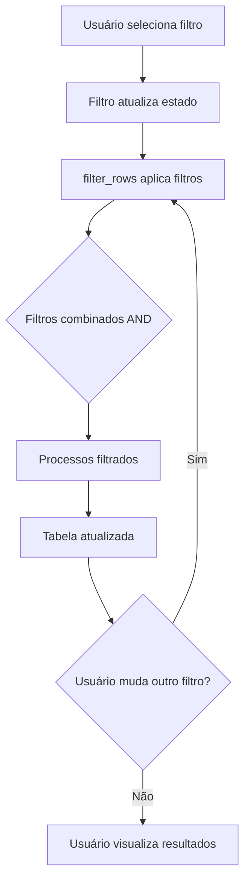

# MAPEAMENTO COMPLETO DO MÓDULO DE PROCESSOS

**Data de Criação:** 2025-01-XX  
**Objetivo:** Documentação completa de todas as funcionalidades, arquivos, componentes e fluxos do módulo de processos do Zantech ERP.

---

## SUMÁRIO EXECUTIVO

O módulo de Processos é um dos principais componentes do Zantech ERP, responsável pelo gerenciamento completo de processos jurídicos. O módulo oferece:

- **CRUD completo** de processos (criar, editar, duplicar, deletar)
- **Hierarquia de processos** (relacionamentos pai-filho para desdobramentos)
- **Acompanhamento de terceiros** (processos de terceiros que afetam clientes)
- **Gestão de protocolos** vinculados aos processos
- **Cenários estratégicos** de desenvolvimento do processo
- **Sistema de permissões** de acesso (advogado, técnicos, clientes)
- **Filtros avançados** e busca textual
- **Auto-save** para campos de texto longo
- **Visualizações múltiplas** (padrão, acesso, por caso)

### Visão Geral
- **Rotas disponíveis:** 3 páginas principais (`/processos`, `/processos/acesso`, `/processos-por-caso`)
- **Arquivos principais:** 40+ arquivos Python organizados em estrutura modular
- **Coleções Firestore:** `processes`, `third_party_monitoring`, `senhas_processo` (subcoleção)
- **Campos de processo:** 45+ campos organizados em 8 abas

---

## 1. ESTRUTURA DE ARQUIVOS

### 1.1 Árvore de Diretórios

```
mini_erp/pages/processos/
├── __init__.py                          # Exports principais do módulo
├── models.py                            # Modelos de dados e constantes
├── database.py                          # Operações CRUD Firestore
├── business_logic.py                    # Validações e regras de negócio
├── utils.py                             # Funções auxiliares e formatação
├── ui_components.py                     # Componentes UI e slots de tabela
├── campos_mapeamento.py                 # Documentação de campos
├── auto_save.py                         # Sistema de auto-save
├── password_security.py                 # Criptografia de senhas
├── auditoria_validacao.py               # Scripts de auditoria
├── diagnostico_processo.py              # Ferramentas de diagnóstico
│
├── visualizacoes/                       # Páginas/rotas do módulo
│   ├── __init__.py
│   ├── visualizacao_padrao.py          # Página principal /processos
│   └── visualizacao_acesso.py          # Página /processos/acesso
│
├── modais/                              # Modais de edição/criação
│   ├── __init__.py
│   ├── modal_processo.py               # Modal principal (8 abas)
│   ├── modal_processo_futuro.py        # Modal processo futuro
│   ├── modal_protocolo.py              # Modal protocolo
│   ├── modal_acompanhamento_terceiros.py
│   ├── abas/                           # (futuro: abas separadas)
│   ├── components/                     # Componentes de modais
│   │   └── passwords_tab.py
│   └── validacoes/                     # Validações específicas
│
└── filtros/                             # Sistema de filtros
    ├── __init__.py
    ├── filtros_manager.py              # Gerencia estado dos filtros
    ├── filtro_helper.py                # Helper genérico
    ├── filtro_area.py
    ├── filtro_casos.py
    ├── filtro_clientes.py
    ├── filtro_status.py
    ├── filtro_pesquisa.py
    ├── aplicar_filtros.py
    └── obter_opcoes_filtros.py
```

### 1.2 Arquivos Relacionados (fora do módulo)

```
mini_erp/pages/
├── processos_por_caso.py               # Página /processos-por-caso
│
mini_erp/core.py                        # Funções core (save_process, get_processes_list, etc)
mini_erp/constants.py                   # Constantes de cores e estilos
```

### 1.3 Dependências Principais

**Arquivos Core:**
- `mini_erp.core` - Funções de acesso ao Firestore e cache
- `mini_erp.firebase_config` - Configuração do Firestore
- `mini_erp.auth` - Autenticação de usuários
- `mini_erp.constants` - Constantes de cores e estilos

**Bibliotecas Externas:**
- `nicegui` - Framework UI (tabelas, modais, formulários)
- `google.cloud.firestore` - Cliente Firestore
- `datetime` - Manipulação de datas

---

## 2. ROTAS E PÁGINAS

### 2.1 Página Principal: `/processos`

**Arquivo:** `mini_erp/pages/processos/visualizacoes/visualizacao_padrao.py`  
**Função:** `processos()`

**Descrição:**
Página principal de listagem de todos os processos cadastrados no sistema. Inclui processos normais, desdobramentos hierárquicos e acompanhamentos de terceiros.

**Funcionalidades:**
- Listagem completa de processos em tabela
- Filtros múltiplos (área, caso, cliente, parte contrária, status)
- Busca textual por título/número
- Ordenação por colunas (data, título, número, status, área)
- Clique no título abre modal de edição
- Context menu para duplicar processo
- Visualização hierárquica (processos principais e desdobramentos)
- Cores diferenciadas para processos futuros e acompanhamentos
- Paginação (20 registros por página)

**Colunas da Tabela:**
1. Data de Abertura (ordenável)
2. Área (com chips coloridos, ordenável)
3. Título (clicável, ordenável)
4. Casos Vinculados
5. Número (com link e botão copiar, ordenável)
6. Clientes (múltiplos, exibidos verticalmente)
7. Parte Contrária (múltiplos, exibidos verticalmente)
8. Status (com badges coloridos, ordenável)

**Ações Disponíveis:**
- Botão "+ NOVO" com menu dropdown:
  - Novo Processo
  - Novo Processo Futuro
  - Novo Acompanhamento de Terceiro
  - Novo Desdobramento de Processo
  - Novo Protocolo
- Botão "Acesso aos Processos" (navega para `/processos/acesso`)
- Filtros interativos com dropdowns
- Botão "Limpar" para resetar filtros

### 2.2 Página de Acesso: `/processos/acesso`

**Arquivo:** `mini_erp/pages/processos/visualizacoes/visualizacao_acesso.py`  
**Função:** `acesso_processos()`

**Descrição:**
Página dedicada ao gerenciamento de permissões de acesso aos processos. Permite controlar quem tem acesso a cada processo (advogado, técnicos, clientes).

**Funcionalidades:**
- Listagem de processos com colunas de permissão
- Checkboxes para solicitar/conceder acesso
- Diferenciação visual entre processos normais e acompanhamentos
- Atualização em tempo real das permissões
- Filtros similares à página principal

**Colunas Específicas:**
- Acesso Solicitado? (checkbox)
- Acesso Concedido? (checkbox)
- Processo Disponibilizado para Técnicos? (checkbox)
- Processos futuros mostram "N.A" (não aplicável)

**Campos de Acesso:**
- `access_lawyer_requested` / `access_lawyer_granted`
- `access_technicians_requested` / `access_technicians_granted`
- `access_client_requested` / `access_client_granted`

### 2.3 Página Processos por Caso: `/processos-por-caso`

**Arquivo:** `mini_erp/pages/processos_por_caso.py`  
**Função:** `processos_por_caso()`

**Descrição:**
Visualização alternativa que agrupa processos por caso, facilitando o gerenciamento de permissões quando há múltiplos processos vinculados ao mesmo caso.

**Funcionalidades:**
- Agrupamento por caso (accordions expansíveis)
- Filtro por sistema processual
- Estatísticas gerais (total de casos, processos)
- Tabelas de processos dentro de cada caso
- Checkboxes de permissão inline
- Seção especial para processos sem caso vinculado
- Links diretos para detalhes do caso

**Estrutura:**
- Accordions por caso (ordenados por quantidade de processos)
- Cada accordion contém tabela de processos do caso
- Checkboxes para permissões (advogado, técnicos, clientes)
- Seção final para processos sem caso vinculado

---

## 3. VISÃO ADMINISTRATIVA VS VISÃO CLIENTE

### 3.1 Comparação Geral

| Aspecto | Visão Administrativa (Escritório) | Visão Cliente |
|---------|-----------------------------------|---------------|
| **Acesso** | ✅ Completo - todas as funcionalidades | ❌ Não existe área específica |
| **Autenticação** | Login obrigatório (`is_authenticated()`) | N/A |
| **Páginas Disponíveis** | 3 páginas principais | Nenhuma dedicada |
| **Operações CRUD** | ✅ Criar, editar, duplicar, deletar | ❌ Apenas dados vinculados |
| **Visualização de Processos** | ✅ Listagem completa com filtros | Apenas via campo `clients` |
| **Gestão de Permissões** | ✅ Página dedicada (`/processos/acesso`) | Campos existem mas são gerenciados pelo escritório |
| **Campos de Acesso** | ✅ Gerenciamento completo | `access_client_*` existem mas não são usados por cliente |

### 3.2 Campos de Acesso do Cliente

Os seguintes campos existem no banco de dados para controle de acesso do cliente, mas **não há interface dedicada para clientes utilizarem diretamente**:

- `access_client_requested` - Cliente solicitou acesso?
- `access_client_granted` - Acesso concedido ao cliente?
- `access_client_comment` - Comentário sobre acesso do cliente

**Observação:** Estes campos são gerenciados exclusivamente pela área administrativa do escritório. O cliente aparece apenas como dado vinculado nos processos (campo `clients`).

### 3.3 Conclusão sobre Visão Cliente

**NÃO EXISTE área específica para clientes acessarem processos diretamente.** O módulo foi projetado como ferramenta interna do escritório, onde:

- Clientes aparecem como **dados vinculados** nos processos (campo `clients`)
- Campos de acesso existem para **controle interno** do escritório
- **Futuro:** Pode ser implementada área do cliente usando os campos `access_client_*` já existentes

---

## 4. BANCO DE DADOS (FIRESTORE)

### 4.1 Coleções Principais

#### 4.1.1 Coleção: `processes`

**Descrição:** Coleção principal que armazena todos os processos jurídicos.

**Estrutura do Documento:**

```python
{
    # ===== CAMPOS OBRIGATÓRIOS =====
    '_id': str,                          # ID do documento (gerado automaticamente)
    'title': str,                        # Título do processo (obrigatório)
    'status': str,                       # Status (obrigatório)
    'process_type': str,                 # 'Existente' ou 'Futuro' (obrigatório)
    
    # ===== DADOS BÁSICOS =====
    'number': str,                       # Número do processo
    'link': str,                         # URL do processo no sistema do tribunal
    'data_abertura': str,                # Data de abertura (DD/MM/AAAA, MM/AAAA ou AAAA)
    
    # ===== PARTES ENVOLVIDAS =====
    'clients': List[str],                # Lista de clientes (nomes de exibição)
    'opposing_parties': List[str],       # Lista de partes contrárias
    'other_parties': List[str],          # Lista de outros envolvidos
    
    # ===== VÍNCULOS =====
    'cases': List[str],                  # Títulos dos casos vinculados (derivado)
    'case_ids': List[str],               # Slugs dos casos vinculados (fonte da verdade)
    'parent_ids': List[str],             # IDs dos processos pais (hierarquia)
    'parent_id': str,                    # DEPRECATED - usar parent_ids
    
    # ===== DADOS JURÍDICOS =====
    'system': str,                       # Sistema processual (eproc, PJe, etc)
    'nucleo': str,                       # Núcleo (geralmente 'Ambiental')
    'area': str,                         # Área do direito
    'result': str,                       # Resultado (Ganho, Perdido, Neutro) - condicional
    'envolve_dano_app': bool,            # Envolve dano em APP?
    'area_total_discutida': float,       # Área total discutida (ha)
    
    # ===== RELATÓRIO (AUTO-SAVE) =====
    'relatory_facts': str,               # Resumo dos Fatos (editor rico)
    'relatory_timeline': str,            # Histórico / Linha do Tempo (editor rico)
    'relatory_documents': str,           # Documentos Relevantes (editor rico)
    
    # ===== ESTRATÉGIA (AUTO-SAVE) =====
    'strategy_objectives': str,          # Objetivos (editor rico)
    'legal_thesis': str,                 # Teses a serem trabalhadas (editor rico)
    'strategy_observations': str,        # Observações (editor rico)
    
    # ===== CENÁRIOS =====
    'scenarios': List[Dict],             # Lista de cenários
    # Estrutura de cenário:
    # {
    #     'title': str,
    #     'type': str,                    # '🟢 Positivo', '⚪ Neutro', '🔴 Negativo'
    #     'status': str,                  # 'Mapeado', 'Em análise', 'Próximo de ocorrer', 'Ocorrido', 'Descartado'
    #     'impact': str,                  # 'Muito bom', 'Bom', 'Moderado', 'Ruim', 'Muito ruim'
    #     'chance': str,                  # 'Muito alta', 'Alta', 'Média', 'Baixa', 'Muito baixa'
    #     'obs': str
    # }
    
    # ===== PROTOCOLOS =====
    'protocols': List[Dict],             # Lista de protocolos vinculados
    # Estrutura de protocolo:
    # {
    #     'title': str,
    #     'date': str,                    # DD/MM/AAAA
    #     'number': str,
    #     'system': str,
    #     'link': str,
    #     'observations': str,
    #     'case_ids': List[str],
    #     'process_ids': List[str]
    # }
    
    # ===== PERMISSÕES DE ACESSO =====
    'access_lawyer_requested': bool,
    'access_lawyer_granted': bool,
    'access_lawyer_comment': str,
    'access_technicians_requested': bool,
    'access_technicians_granted': bool,
    'access_technicians_comment': str,
    'access_client_requested': bool,
    'access_client_granted': bool,
    'access_client_comment': str,
    
    # ===== METADADOS (auto-gerados) =====
    'title_searchable': str,             # Título em minúsculas para busca
    'depth': int,                        # Profundidade na hierarquia (0=raiz, 1=filho, etc)
    'state': str,                        # Estado herdado do primeiro caso vinculado
    'created_at': str,                   # Timestamp ISO
    'updated_at': str,                   # Timestamp ISO
    'created_by': str,                   # ID do usuário criador
    'isDeleted': bool                    # Soft delete (False = ativo)
}
```

**Índices Sugeridos:**
- `status` (para filtros)
- `area` (para filtros)
- `case_ids` (para busca por caso)
- `title_searchable` (para busca textual)

#### 4.1.2 Subcoleção: `senhas_processo`

**Caminho:** `processes/{process_id}/senhas_processo/{password_id}`

**Descrição:** Armazena senhas de acesso aos sistemas processuais de forma criptografada.

**Estrutura:**
```python
{
    '_id': str,                          # ID único da senha
    'system': str,                       # Sistema ao qual a senha pertence
    'username': str,                     # Usuário (criptografado)
    'password': str,                     # Senha (criptografada)
    'observations': str,                 # Observações adicionais
    'created_at': str,                   # Timestamp ISO
    'updated_at': str                    # Timestamp ISO
}
```

**Segurança:** Senhas são criptografadas usando `password_security.py` (AES-256).

#### 4.1.3 Coleção: `third_party_monitoring`

**Descrição:** Armazena acompanhamentos de processos de terceiros que afetam clientes.

**Estrutura do Documento:**

```python
{
    '_id': str,                          # ID único (UUID)
    'title': str,                        # Título do acompanhamento (obrigatório)
    'process_title': str,                # Alias para title (compatibilidade)
    'process_number': str,               # Número do processo
    'link_do_processo': str,             # Link do processo
    'link': str,                         # Alias para link_do_processo
    
    # ===== PARTES ENVOLVIDAS (novo schema) =====
    'parte_ativa': List[str],            # Obrigatório - array de IDs/nomes
    'parte_passiva': List[str],          # Opcional - array de IDs/nomes
    'outros_envolvidos': List[str],      # Opcional - array de IDs/nomes
    
    # ===== VÍNCULOS =====
    'processos_pais': List[str],         # IDs dos processos pais
    'cases': List[str],                  # Casos vinculados
    
    # ===== CAMPOS LEGADOS (compatibilidade) =====
    'clientes': List[str],               # DEPRECATED - usar parte_ativa
    'client_id': str,                    # DEPRECATED
    'client_name': str,                  # DEPRECATED
    'parte_contraria': List[str],        # DEPRECATED - usar parte_passiva
    'third_party_name': str,             # DEPRECATED
    
    # ===== STATUS E METADADOS =====
    'status': str,                       # 'ativo', 'concluído', 'suspenso'
    'monitoring_type': str,              # Tipo de acompanhamento
    'start_date': str,                   # Data de início (DD/MM/AAAA)
    'observations': str,                 # Observações adicionais
    'created_at': str,                   # Timestamp ISO
    'updated_at': str                    # Timestamp ISO
}
```

### 4.2 Relacionamentos

#### 4.2.1 Processos ↔ Casos

**Fonte da Verdade:** Processos (campo `case_ids`)

- Processos têm `case_ids`: array de slugs dos casos vinculados
- Casos têm `process_ids`: array de IDs dos processos (derivado, sincronizado)
- Função de sincronização: `sync_processes_cases()` em `mini_erp.core`

**Regras:**
1. Processos são a fonte da verdade - `case_ids` define os vínculos
2. Casos têm `process_ids` derivados (sincronizados automaticamente)
3. Títulos são mantidos para compatibilidade e buscas

#### 4.2.2 Processos ↔ Processos (Hierarquia)

**Campos:** `parent_ids` (lista de IDs dos processos pais)

- Um processo pode ter múltiplos processos pais
- Suporta hierarquia multi-nível (pai → filho → neto → bisneto)
- Campo `depth` calcula profundidade automaticamente (0=raiz)
- Validação anti-ciclo implementada

#### 4.2.3 Processos ↔ Clientes

**Campo:** `clients` (lista de nomes de exibição)

- Armazena nomes de exibição (não IDs)
- Busca por nome completo, nome_completo ou display_name
- Sempre exibido em MAIÚSCULAS

#### 4.2.4 Processos ↔ Protocolos

**Campo:** `protocols` (array de objetos ProtocolDict)

- Protocolos podem estar vinculados a múltiplos processos e casos
- Campo `process_ids` no protocolo indica processos vinculados
- Campo `case_ids` no protocolo indica casos vinculados

### 4.3 Operações CRUD

#### 4.3.1 Criar Processo

**Função:** `save_process()` em `database.py`  
**Endpoint Firestore:** `processes/{doc_id}`  
**Validações:**
- Título obrigatório e não vazio
- Status obrigatório
- Tipo de processo obrigatório
- Validação de ciclos na hierarquia

#### 4.3.2 Ler Processos

**Funções:**
- `get_all_processes()` - Todos os processos
- `get_processes_with_children()` - Processos agrupados por hierarquia
- `get_process_by_index()` - Processo por índice

**Filtros Firestore:**
- Soft delete: `isDeleted != True`
- Busca textual: `title_searchable` (case-insensitive)

#### 4.3.3 Atualizar Processo

**Função:** `save_process()` com `doc_id` fornecido  
**Auto-save:** Campos de texto longo salvam automaticamente a cada 30s

#### 4.3.4 Deletar Processo

**Função:** `delete_process()` em `database.py`  
**Tipo:** Soft delete (campo `isDeleted = True`)

#### 4.3.5 Duplicar Processo

**Função:** `duplicar_processo()` em `database.py`  
**Comportamento:**
- Cria cópia com novo ID
- Título recebe sufixo "[CÓPIA]"
- Campos de metadados resetados (created_at, updated_at)
- Todos os outros campos copiados

---

## 5. COMPONENTES UI

### 5.1 Modal Principal: Processo

**Arquivo:** `modais/modal_processo.py`  
**Função:** `render_process_dialog()`

**Estrutura:**
- Modal com sidebar fixa à esquerda (170px)
- 8 abas de conteúdo à direita
- Altura: 80vh (máximo)
- Scroll automático no conteúdo

#### 5.1.1 Abas do Modal

1. **Dados Básicos**
   - Título* (obrigatório)
   - Número
   - Link
   - Tipo de processo* (Existente/Futuro)
   - Data de abertura (3 formatos aceitos)
   - Clientes (multi-select com chips)
   - Parte Contrária (multi-select com chips)
   - Outros Envolvidos (multi-select com chips)
   - Processos Pais (multi-select com chips)
   - Casos Vinculados (multi-select com chips)

2. **Dados Jurídicos**
   - Sistema Processual
   - Núcleo
   - Área
   - Status* (obrigatório)
   - Resultado (condicional - aparece se status = Concluído)
   - Envolve Dano em APP? (switch)
   - Área Total Discutida (ha)

3. **Relatório** (auto-save)
   - Resumo dos Fatos (editor rico)
   - Histórico / Linha do Tempo (editor rico)
   - Documentos Relevantes (editor rico)

4. **Estratégia** (auto-save)
   - Objetivos (editor rico)
   - Teses a serem trabalhadas (editor rico)
   - Observações (editor rico)

5. **Cenários**
   - Lista de cenários
   - Botão para adicionar novo cenário
   - Cada cenário tem: tipo, status, impacto, chance, observações
   - Ícones e cores diferenciadas por tipo/status

6. **Protocolos**
   - Lista de protocolos vinculados
   - Botão para criar novo protocolo (abre modal dedicado)
   - Botão para vincular protocolo existente

7. **Senhas de Acesso**
   - Lista de senhas criptografadas
   - Botão para adicionar senha
   - Campos: sistema, usuário, senha, observações
   - Exibição mascarada da senha (botão mostrar/ocultar)

8. **Slack** (não implementado)
   - Placeholder para integração futura

#### 5.1.2 Funcionalidades do Modal

- **Validação antes de salvar:** Título, status e tipo obrigatórios
- **Auto-save:** Campos de relatório e estratégia salvam automaticamente
- **Busca inteligente:** Seletores de pessoas/casos com busca
- **Chips interativos:** Adicionar/remover itens com chips coloridos
- **Validação de hierarquia:** Previne ciclos em processos pais
- **Feedback visual:** Indicadores de salvamento (Salvando... / Salvo às HH:MM)

### 5.2 Modal: Processo Futuro

**Arquivo:** `modais/modal_processo_futuro.py`  
**Função:** `render_future_process_dialog()`

**Descrição:** Modal simplificado para criar processos futuros/previstos.

**Abas:**
1. Dados básicos (simplificado)
2. Dados jurídicos (simplificado)
3. Descrição (campo único de texto)

**Diferenças do modal principal:**
- Menos campos obrigatórios
- Status automaticamente definido como "Futuro/Previsto"
- Sem campos de relatório/estratégia completos

### 5.3 Modal: Protocolo

**Arquivo:** `modais/modal_protocolo.py`  
**Função:** `render_protocol_dialog()`

**Campos:**
- Título
- Data (DD/MM/AAAA)
- Número
- Sistema
- Link
- Observações
- Casos vinculados (multi-select)
- Processos vinculados (multi-select)

### 5.4 Modal: Acompanhamento de Terceiros

**Arquivo:** `modais/modal_acompanhamento_terceiros.py`  
**Função:** `render_third_party_monitoring_dialog()`

**Estrutura similar ao modal principal mas com campos específicos:**
- Parte Ativa (obrigatório)
- Parte Passiva (opcional)
- Outros Envolvidos (opcional)
- Tipo de acompanhamento
- Data de início
- Status (ativo, concluído, suspenso)

### 5.5 Tabelas

#### 5.5.1 Tabela Principal (`/processos`)

**Componente:** `ui.table` do NiceGUI  
**Slots Customizados:**
- `body-cell-area` - Chips coloridos por área
- `body-cell-title` - Título clicável com context menu
- `body-cell-status` - Badges coloridos por status
- `body-cell-number` - Link clicável + botão copiar
- `body-cell-clients` - Lista vertical de clientes
- `body-cell-opposing` - Lista vertical de partes contrárias
- `body-cell-cases` - Lista de casos separados por vírgula
- `body-cell-data_abertura` - Data formatada com atributos data-*

**Estilos CSS:**
- Cores alternadas (par/ímpar)
- Hover suave
- Linhas especiais para processos futuros (roxo) e acompanhamentos (azul)
- Fonte compacta (11px)

#### 5.5.2 Tabela de Acesso (`/processos/acesso`)

**Slots Adicionais:**
- `body-cell-access_requested` - Checkbox solicitado
- `body-cell-access_granted` - Checkbox concedido
- `body-cell-access_technicians` - Checkbox técnicos
- "N.A" para processos futuros

### 5.6 Sistema de Filtros

**Localização:** `filtros/`

**Arquitetura:**
- `filtros_manager.py` - Gerencia estado dos filtros
- `aplicar_filtros.py` - Aplica filtros aos dados
- `obter_opcoes_filtros.py` - Extrai opções dos dados
- Filtros individuais por tipo (`filtro_area.py`, `filtro_casos.py`, etc)

**Filtros Disponíveis:**
1. **Pesquisa textual** - Busca em título/número
2. **Área** - Dropdown com áreas únicas
3. **Casos** - Dropdown com casos vinculados
4. **Clientes** - Dropdown com clientes únicos
5. **Parte** - Alias para clientes
6. **Parte Contrária** - Dropdown com partes contrárias únicas
7. **Status** - Dropdown com status únicos

**Comportamento:**
- Filtros são combinados com AND (todos devem passar)
- Valores vazios não aplicam filtro (mostra todos)
- Opções são extraídas dinamicamente dos dados
- Estado persiste em `app.storage.user` (filtro de casos)

### 5.7 Cores e Estilos

#### 5.7.1 Cores por Área

Definidas em `mini_erp.constants`:

```python
AREA_COLORS = {
    'Administrativo': '#6b7280',      # Cinza
    'Criminal': '#dc2626',            # Vermelho
    'Cível': '#2563eb',               # Azul
    'Tributário': '#7c3aed',          # Roxo
    'Técnico/projetos': '#22c55e',    # Verde
    'Outros': '#e5e7eb'               # Cinza claro
}
```

#### 5.7.2 Cores por Status

```python
STATUS_COLORS = {
    'Em andamento': '#fde047',              # Amarelo
    'Concluído': '#4ade80',                 # Verde
    'Concluído com pendências': '#a3e635',  # Verde claro
    'Em monitoramento': '#fdba74',          # Laranja
    'Futuro/Previsto': '#e9d5ff'            # Roxo claro
}
```

#### 5.7.3 Linhas Especiais na Tabela

- **Processos Futuros:** Fundo roxo claro (`#F3E5F5`) com borda esquerda roxa
- **Processos Concluídos:** Fundo verde claro (`#E8F5E9`) com borda esquerda verde
- **Acompanhamentos de Terceiros:** Fundo azul claro (`#E8F1FF`) com borda esquerda azul

---

## 6. FUNCIONALIDADES DETALHADAS

### 6.1 Operações CRUD

#### 6.1.1 Criar Processo

**Localização:** Modal principal → Botão "Salvar"  
**Validações:**
- Título obrigatório
- Status obrigatório
- Tipo obrigatório
- Validação de ciclos na hierarquia
- Validação de área total (deve ser numérico e positivo)

**Fluxo:**
1. Usuário preenche formulário
2. Clica em "Salvar"
3. Validações executadas
4. `build_process_data()` monta dicionário
5. `save_process()` salva no Firestore
6. Cache invalidado
7. Tabela recarregada
8. Modal fechado

#### 6.1.2 Editar Processo

**Localização:** Clique no título do processo na tabela  
**Fluxo:**
1. Clique abre modal com dados preenchidos
2. Usuário edita campos
3. Auto-save para campos de texto longo (a cada 30s)
4. Clica em "Salvar" para salvar outros campos
5. Atualização no Firestore
6. Cache invalidado
7. Tabela atualizada

#### 6.1.3 Duplicar Processo

**Localização:** Context menu (botão direito) no título → "Duplicar Processo"  
**Fluxo:**
1. Context menu aberto
2. Usuário seleciona "Duplicar Processo"
3. `duplicar_processo()` cria cópia
4. Título recebe "[CÓPIA]"
5. Novo ID gerado
6. Metadados resetados
7. Modal de edição aberto automaticamente para o novo processo

#### 6.1.4 Deletar Processo

**Localização:** Modal principal → Botão "Excluir"  
**Fluxo:**
1. Confirmação solicitada
2. `delete_process()` executa soft delete
3. Campo `isDeleted = True`
4. Processo não aparece mais nas listagens
5. Cache invalidado
6. Tabela recarregada

### 6.2 Hierarquia de Processos

#### 6.2.1 Desdobramentos

**Conceito:** Processos podem ter relacionamentos pai-filho para representar desdobramentos.

**Implementação:**
- Campo `parent_ids`: lista de IDs dos processos pais
- Campo `depth`: profundidade calculada (0=raiz, 1=filho, etc)
- Função `get_processes_with_children()` agrupa processos hierarquicamente

**Visualização:**
- Processos principais aparecem primeiro
- Desdobramentos aparecem indentados (prefixo 🔀)
- Ordenação: processos principais primeiro, depois desdobramentos

**Validações:**
- Processo não pode ser pai de si mesmo
- Validação anti-ciclo (processo A → processo B → processo A)

#### 6.2.2 Criar Desdobramento

**Localização:** Botão "+ NOVO" → "Novo Desdobramento de Processo"  
**Fluxo:**
1. Diálogo para selecionar processo pai
2. Modal de novo processo aberto com `parent_process_id` preenchido
3. Processo criado já vinculado ao pai

### 6.3 Acompanhamento de Terceiros

**Conceito:** Processos de terceiros que afetam clientes do escritório (ex: processo do sócio que afeta a empresa).

**Funcionalidades:**
- Criar novo acompanhamento
- Editar acompanhamento existente
- Listar acompanhamentos (misturados com processos na tabela principal)
- Filtro dedicado para acompanhamentos
- Visualização diferenciada (fundo azul claro)

**Campos Específicos:**
- Parte Ativa (obrigatório)
- Parte Passiva (opcional)
- Tipo de acompanhamento
- Status (ativo, concluído, suspenso)

### 6.4 Protocolos

**Conceito:** Documentos protocolados que podem estar vinculados a múltiplos processos e casos.

**Funcionalidades:**
- Criar novo protocolo (modal dedicado)
- Vincular protocolo existente a processo
- Listar protocolos vinculados no processo
- Editar/deletar protocolo

**Vinculações:**
- Protocolos podem estar vinculados a múltiplos processos (`process_ids`)
- Protocolos podem estar vinculados a múltiplos casos (`case_ids`)

### 6.5 Cenários

**Conceito:** Cenários estratégicos de desenvolvimento do processo (positivos, neutros, negativos).

**Campos:**
- Título
- Tipo: 🟢 Positivo, ⚪ Neutro, 🔴 Negativo
- Status: Mapeado, Em análise, Próximo de ocorrer, Ocorrido, Descartado
- Impacto: Muito bom, Bom, Moderado, Ruim, Muito ruim
- Chance: Muito alta, Alta, Média, Baixa, Muito baixa
- Observações

**Visualização:**
- Ícones e cores diferenciadas por tipo
- Badges coloridos por status
- Lista editável dentro do modal

### 6.6 Gestão de Senhas

**Conceito:** Armazenamento seguro de senhas de acesso aos sistemas processuais.

**Segurança:**
- Criptografia AES-256
- Senhas nunca exibidas em texto plano
- Botão mostrar/ocultar para visualização
- Subcoleção `senhas_processo` no Firestore

**Funcionalidades:**
- Adicionar senha (sistema, usuário, senha, observações)
- Editar senha
- Deletar senha
- Listar senhas por processo

### 6.7 Sistema de Filtros

**Filtros Disponíveis:**
1. **Pesquisa Textual**
   - Busca em `title_raw` (título sem indentação)
   - Case-insensitive
   - Busca por substring

2. **Filtro por Área**
   - Dropdown com áreas únicas
   - Valores extraídos dinamicamente dos processos

3. **Filtro por Caso**
   - Dropdown com casos vinculados
   - Extrai de `cases_list` dos processos
   - Suporta substring matching

4. **Filtro por Cliente**
   - Dropdown com clientes únicos
   - Extrai de `clients_list` dos processos

5. **Filtro por Parte Contrária**
   - Dropdown com partes contrárias únicas
   - Extrai de `opposing_list` dos processos

6. **Filtro por Status**
   - Dropdown com status únicos
   - Valores extraídos dinamicamente

**Comportamento:**
- Filtros são combinados com AND
- Valores vazios não aplicam filtro
- Botão "Limpar" reseta todos os filtros
- Estado persiste (apenas filtro de casos)

### 6.8 Auto-Save

**Conceito:** Salvamento automático de campos de texto longo para evitar perda de dados.

**Implementação:** `auto_save.py`

**Campos com Auto-Save:**
- `relatory_facts` - Resumo dos Fatos
- `relatory_timeline` - Histórico / Linha do Tempo
- `relatory_documents` - Documentos Relevantes
- `strategy_objectives` - Objetivos
- `legal_thesis` - Teses a serem trabalhadas
- `strategy_observations` - Observações

**Configuração:**
- Intervalo: 30 segundos
- Apenas quando processo já foi salvo (tem ID)
- Indicador visual de status (Salvando... / Salvo às HH:MM / Erro)

### 6.9 Busca e Ordenação

#### 6.9.1 Busca Textual

- Campo de busca no topo da tabela
- Busca em título e número
- Case-insensitive
- Busca por substring
- Atualização em tempo real conforme digitação

#### 6.9.2 Ordenação

**Colunas Ordenáveis:**
- Data de abertura (usa `data_abertura_sort`)
- Área
- Título
- Número
- Status

**Implementação:**
- Usa recursos nativos do NiceGUI (`sortable: True`)
- Ordenação por clique no cabeçalho da coluna
- Alterna entre ascendente/descendente

### 6.10 Sincronização Processos-Casos

**Conceito:** Manter sincronização bidirecional entre processos e casos.

**Função:** `sync_processes_cases()` em `mini_erp.core`

**Regras:**
1. Processos são fonte da verdade (`case_ids`)
2. Casos têm `process_ids` derivados (sincronizados)
3. Títulos mantidos para compatibilidade

**Execução:**
- Automática após salvar processo (se `sync=True`)
- Manual quando necessário
- Otimizada para performance (cache)

---

## 7. FLUXOS DE TRABALHO

### 7.1 Fluxo: Criar Novo Processo



### 7.2 Fluxo: Editar Processo Existente



### 7.3 Fluxo: Duplicar Processo

```mermaid
flowchart TD
    A[Usuário clica direito no título] --> B[Context menu aparece]
    B --> C[Seleciona 'Duplicar Processo']
    C --> D[duplicar_processo cria cópia]
    D --> E[Título recebe '[CÓPIA]']
    E --> F[Novo ID gerado]
    F --> G[Metadados resetados]
    G --> H[Processo salvo no Firestore]
    H --> I[Modal de edição abre automaticamente]
    I --> J[Usuário edita e salva]
```

### 7.4 Fluxo: Filtrar Processos



---

## 8. OBSERVAÇÕES E RECOMENDAÇÕES

### 8.1 Pontos Fortes

1. **Estrutura Modular Bem Organizada**
   - Separação clara de responsabilidades (models, database, business_logic, UI)
   - Filtros extraídos em módulos separados
   - Modais organizados por funcionalidade

2. **Funcionalidades Completas**
   - CRUD completo
   - Hierarquia de processos
   - Acompanhamento de terceiros
   - Sistema de permissões

3. **UX Cuidadosa**
   - Auto-save para evitar perda de dados
   - Filtros intuitivos
   - Feedback visual adequado
   - Cores e badges informativos

4. **Segurança**
   - Senhas criptografadas
   - Autenticação obrigatória
   - Soft delete para auditoria

### 8.2 Pontos de Atenção

1. **Área do Cliente Não Implementada**
   - Campos `access_client_*` existem mas não há interface para clientes
   - Recomendação: Implementar área do cliente ou remover campos não utilizados

2. **Performance**
   - Múltiplas queries ao Firestore podem ser otimizadas
   - Cache implementado mas pode ser melhorado
   - Carregamento paralelo já implementado em alguns pontos

3. **Validações**
   - Algumas validações poderiam ser mais rigorosas (ex: formato de data)
   - Validação de URL para campo `link` não implementada

4. **Integração Slack**
   - Aba "Slack" existe mas não está implementada
   - Recomendação: Implementar ou remover aba

### 8.3 Recomendações para Melhorias

1. **Implementar Área do Cliente**
   - Criar rota `/cliente/processos`
   - Usar campos `access_client_*` já existentes
   - Interface simplificada (somente visualização)

2. **Otimizações de Performance**
   - Implementar paginação server-side
   - Usar índices compostos no Firestore
   - Reduzir número de queries

3. **Melhorias de Validação**
   - Validação de formato de data mais rigorosa
   - Validação de URL
   - Validação de formato de número de processo

4. **Documentação**
   - API documentation (Swagger/OpenAPI)
   - Guias de uso para usuários finais
   - Diagramas de arquitetura atualizados

5. **Testes**
   - Testes unitários para business_logic
   - Testes de integração para database
   - Testes E2E para fluxos principais

---

## 9. REFERÊNCIAS

### 9.1 Arquivos Principais

- `mini_erp/pages/processos/visualizacoes/visualizacao_padrao.py` - Página principal
- `mini_erp/pages/processos/visualizacoes/visualizacao_acesso.py` - Página de acesso
- `mini_erp/pages/processos/modais/modal_processo.py` - Modal principal
- `mini_erp/pages/processos/database.py` - Operações CRUD
- `mini_erp/pages/processos/models.py` - Modelos e constantes
- `mini_erp/pages/processos/business_logic.py` - Regras de negócio

### 9.2 Documentação Relacionada

- `RELATORIO_AUDITORIA_PROCESSOS.md` - Auditoria de campos
- `DOCUMENTACAO_ACOMPANHAMENTO_TERCEIROS.md` - Acompanhamentos
- `mini_erp/pages/processos/campos_mapeamento.py` - Mapeamento completo de campos
- `mini_erp/pages/processos/README_REFATORACAO.md` - Histórico de refatoração

### 9.3 Constantes e Configurações

- `mini_erp.constants` - Cores e estilos
- `mini_erp.core` - Funções core do sistema
- `mini_erp.firebase_config` - Configuração Firestore

---

**Documento gerado automaticamente - 2025-01-XX**


